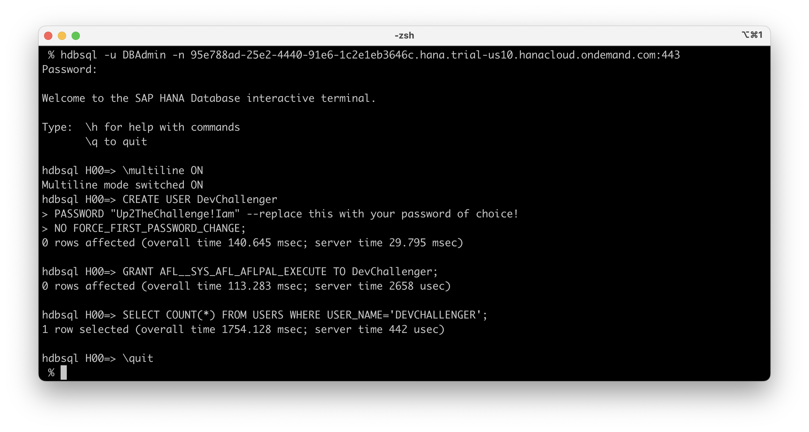

## Create `DEVCHALLENGER` user in your SAP HANA db instance in SAP HANA Cloud Trial

### ... using `hdbsql`

1. Connect as an administrator, eg. `DBAdmin` user in the command below.
    ```Shell
    hdbsql -u DBAdmin -n <yourinstanceSQLendpointhost>:<yourinstanceSQLendpointport>
    ```

2. Switch the input to multiline SQL statements separated with `;` by default.
    ```SQL
    \multiline ON
    ```

3. Execute SQL statement to create a user `DEVCHALLENGER` (with a password `Up2TheChallenge!Iam` in the example below).
    ```SQL
    CREATE USER DevChallenger 
    PASSWORD "Up2TheChallenge!Iam" --replace this with your password of choice!
    NO FORCE_FIRST_PASSWORD_CHANGE;
    ```

4. Execute SQL statement to grant a role `AFL__SYS_AFL_AFLPAL_EXECUTE` to the user `DEVCHALLENGER`. 
    ```SQL
    GRANT AFL__SYS_AFL_AFLPAL_EXECUTE TO DevChallenger;
    ```

5. Optionally, check that the user record has been added to the `USERS` system table.
    ```SQL
    SELECT COUNT(*) FROM USERS WHERE USER_NAME='DEVCHALLENGER';
    ```

6. Quit `hdbsql` utility.
    ```SQL
    \quit
    ```

