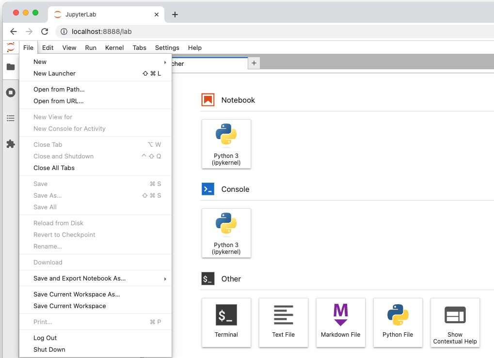

There are many possible approaches to work with Jupyter notebooks. Here is one of the recommended sequence of steps using miniconda.

1. Install `conda` using Miniconda on your OS by following https://docs.conda.io/en/latest/miniconda.html
2. From the command line create an environment required for the challenge with Python 3.10 and JupyterLabs:
    ```shell
    conda create -n hana-eda python=3.10 jupyterlab shapely
    ```
4. You should see `hana-eda` as one of the environments created
    ```shell
    conda env list
    ```
3. Activate conda's `hana-eda` environment
    ```shell
    conda activate hana-eda
    ```
7. Install [Python machine learning client for SAP HANA (hana-ml)](https://help.sap.com/doc/cd94b08fe2e041c2ba778374572ddba9/latest/en-US/Installation.html)
    ```
    python -m pip install hana-ml
    ```
5. Start JupyterLab from the folder with which you plan to work, e.g. from a local clone of this repository
    ```shell
    jupyter-lab
    ```
6. To end the work with JupyterLab select **File** -> **Shut down**
    
